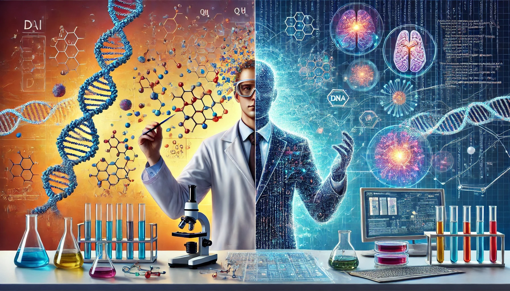

## Welcome to my github where AI meets Bio x Bio 

- 🔭 I’m currently working on Virtual Cell Challenge, Enzyme Engineeting Challenge, Protein Designing Project and Integrated Analysis Environment for Wet-Lab Scientists.
- 🌱 I’m currently learning Graph Neural Networks, Physics Based Neural Networks, Models that combine biophysical and biochemical properties of a protein, Model Context Protocol, Front End engineering to create a user interface
- 👯 I’m looking to collaborate on Protein Designing and designing DL models for omics datasets
- 🤔 I’m looking for help with Front End engineering to create a user interface
- 💬 I blog at https://medium.com/@mukulsherekar
- 📫 How to reach me: https://www.linkedin.com/in/mukulsherekar/

<!--
**msherekar/msherekar** is a ✨ _special_ ✨ repository because its `README.md` (this file) appears on your GitHub profile.

Here are some ideas to get you started:

- 🔭 I’m currently working on Virtual Cell Challenge, Enzyme Engineeting Challenge, Protein Designing Project and Integrated Analysis Environment for Wet-Lab Scientists.
- 🌱 I’m currently learning Graph Neural Networks, Physics Based Neural Networks, Models that combine biophysical and biochemical properties of a protein, Model Context Protocol, Front End engineering to create a user interface
- 👯 I’m looking to collaborate on Protein Designing and designing DL models for omics datasets
- 🤔 I’m looking for help with Front End engineering to create a user interface
- 💬 I blog at https://medium.com/@mukulsherekar
- 📫 How to reach me: https://www.linkedin.com/in/mukulsherekar/
-->
